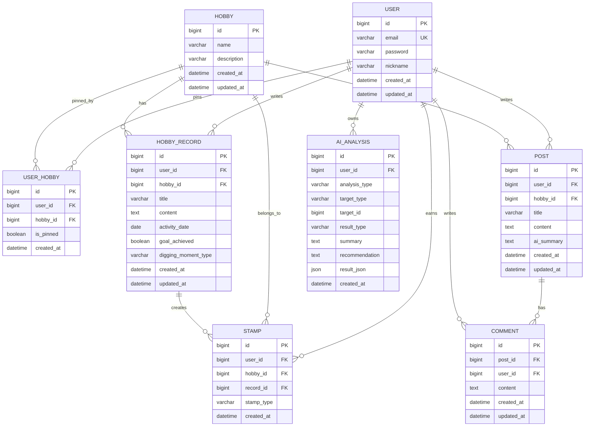

# HobbyStamp ERD

## 설계 기준

HobbyStamp는 개인 취미 기록, 스탬프 보상, 취미 커뮤니티, AI 분석 기능을 가진 서비스이다.

현재 MVP에서는 복잡한 GPS, 취미별 세부 대상, 실시간 채팅, 이미지 업로드는 제외한다.  
다만 추후 확장을 고려하여 `Hobby`, `HobbyRecord`, `Post`, `Comment`, `Stamp`, `AiAnalysis`를 분리한다.

---

## 핵심 설계 의도

| 구분 | 테이블 | 설명 |
|---|---|---|
| 사용자 | `User` | 회원 정보와 로그인 기준 |
| 취미 카테고리 | `Hobby` | 등산, 독서, 운동, 그림, 요리 등 기본 취미 카테고리 |
| 관심 취미 | `UserHobby` | 사용자가 상단에 고정한 관심 취미 |
| 개인 기록 | `HobbyRecord` | 사용자의 비공개 취미 활동 기록 |
| 스탬프 | `Stamp` | 기록 작성, 목표 달성 등에 따라 획득하는 보상 |
| 커뮤니티 글 | `Post` | 취미별 공개 게시글 |
| 댓글 | `Comment` | 게시글 댓글 |
| AI 분석 | `AiAnalysis` | 게시글 요약, 사용자 취미 유형 분석 결과 저장 |

---

## Mermaid ERD

---

## 테이블 상세

### 1. User

사용자 계정 정보를 저장한다.

| 컬럼명 | 타입 | 설명 |
|---|---|---|
| id | bigint | 사용자 ID |
| email | varchar | 이메일, 로그인 ID |
| password | varchar | 암호화된 비밀번호 |
| nickname | varchar | 닉네임 |
| created_at | datetime | 생성일 |
| updated_at | datetime | 수정일 |

---

### 2. Hobby

취미 카테고리 정보를 저장한다.

| 컬럼명 | 타입 | 설명 |
|---|---|---|
| id | bigint | 취미 ID |
| name | varchar | 취미 이름 |
| description | varchar | 취미 설명 |
| created_at | datetime | 생성일 |
| updated_at | datetime | 수정일 |

예시 데이터:

| name | description |
|---|---|
| 등산 | 산을 오르며 기록을 남기는 취미 |
| 독서 | 읽은 책과 감상을 기록하는 취미 |
| 운동 | 운동 루틴과 목표를 기록하는 취미 |
| 그림 | 그림 활동과 결과물을 기록하는 취미 |
| 요리 | 요리 과정과 결과를 기록하는 취미 |

---

### 3. UserHobby

사용자가 관심 취미로 고정한 카테고리를 저장한다.

| 컬럼명 | 타입 | 설명 |
|---|---|---|
| id | bigint | 관심 취미 ID |
| user_id | bigint | 사용자 ID |
| hobby_id | bigint | 취미 ID |
| is_pinned | boolean | 상단 고정 여부 |
| created_at | datetime | 생성일 |

설계 이유:

- 한 사용자가 여러 취미를 고정할 수 있다.
- 하나의 취미도 여러 사용자에게 고정될 수 있다.
- `User`와 `Hobby`는 다대다 관계이므로 중간 테이블을 둔다.

---

### 4. HobbyRecord

사용자의 개인 취미 기록을 저장한다.

| 컬럼명 | 타입 | 설명 |
|---|---|---|
| id | bigint | 기록 ID |
| user_id | bigint | 작성자 ID |
| hobby_id | bigint | 취미 ID |
| title | varchar | 기록 제목 |
| content | text | 기록 내용 |
| activity_date | date | 실제 활동 날짜 |
| goal_achieved | boolean | 사용자가 정한 목표 달성 여부 |
| digging_moment_type | varchar | 디깅모멘트 유형 |
| created_at | datetime | 생성일 |
| updated_at | datetime | 수정일 |

설계 이유:

- 개인 취미 기록은 커뮤니티 게시글과 목적이 다르므로 `Post`와 분리한다.
- 기록 작성 시 기본 스탬프를 생성할 수 있다.
- 목표 달성 여부에 따라 추가 스탬프를 줄 수 있다.

---

### 5. Stamp

사용자가 획득한 스탬프를 저장한다.

| 컬럼명 | 타입 | 설명 |
|---|---|---|
| id | bigint | 스탬프 ID |
| user_id | bigint | 사용자 ID |
| hobby_id | bigint | 취미 ID |
| record_id | bigint | 관련 취미 기록 ID |
| stamp_type | varchar | 스탬프 종류 |
| created_at | datetime | 획득일 |

MVP 스탬프 규칙:

| stamp_type | 설명 |
|---|---|
| RECORD_CREATED | 취미 기록 작성 시 획득 |
| GOAL_ACHIEVED | 목표 달성 기록 작성 시 획득 |

설계 이유:

- 사용자가 직접 만드는 데이터가 아니라 서버가 기록 작성 이벤트에 따라 생성한다.
- 추후 `StampRule` 테이블을 추가하면 연속 기록, 취미별 업적, 산 정복 스탬프로 확장할 수 있다.

---

### 6. Post

취미 커뮤니티 게시글을 저장한다.

| 컬럼명 | 타입 | 설명 |
|---|---|---|
| id | bigint | 게시글 ID |
| user_id | bigint | 작성자 ID |
| hobby_id | bigint | 취미 ID |
| title | varchar | 제목 |
| content | text | 내용 |
| ai_summary | text | AI 3줄 요약 결과 |
| created_at | datetime | 생성일 |
| updated_at | datetime | 수정일 |

설계 이유:

- `HobbyRecord`는 개인 기록이고, `Post`는 공개 커뮤니티 글이다.
- 게시글은 취미 카테고리와 연결되어 취미별 커뮤니티를 구성할 수 있다.
- AI 3줄 요약은 MVP에서는 `Post.ai_summary`에 저장한다.

---

### 7. Comment

게시글 댓글을 저장한다.

| 컬럼명 | 타입 | 설명 |
|---|---|---|
| id | bigint | 댓글 ID |
| post_id | bigint | 게시글 ID |
| user_id | bigint | 작성자 ID |
| content | text | 댓글 내용 |
| created_at | datetime | 생성일 |
| updated_at | datetime | 수정일 |

설계 이유:

- 하나의 게시글은 여러 댓글을 가질 수 있다.
- 댓글 활동은 추후 AI 취미 유형 분석에 활용할 수 있다.

---

### 8. AiAnalysis

AI 분석 결과를 저장한다.

| 컬럼명 | 타입 | 설명 |
|---|---|---|
| id | bigint | AI 분석 ID |
| user_id | bigint | 사용자 ID |
| analysis_type | varchar | 분석 종류 |
| target_type | varchar | 분석 대상 종류 |
| target_id | bigint | 분석 대상 ID |
| result_type | varchar | 분석 결과 유형 |
| summary | text | 분석 요약 |
| recommendation | text | 추천 문장 |
| result_json | json | 상세 분석 결과 |
| created_at | datetime | 생성일 |

분석 종류 예시:

| analysis_type | 설명 |
|---|---|
| POST_SUMMARY | 게시글 3줄 요약 |
| HOBBY_TYPE | 사용자 취미 유형 분석 |
| WEEKLY_SUMMARY | 주간 취미 기록 요약 |

target_type 예시:

| target_type | 설명 |
|---|---|
| POST | 게시글 대상 분석 |
| USER | 사용자 전체 활동 분석 |
| RECORD | 개인 기록 대상 분석 |

설계 이유:

- AI 기능은 게시글 요약, 취미 유형 분석, 주간 요약 등으로 확장될 수 있다.
- 분석 결과를 별도 테이블에 저장하면 AI 재생성, 최신 결과 조회, 분석 이력 관리가 가능하다.
- MVP에서는 게시글 요약을 `Post.ai_summary`에 저장하고, 사용자 취미 유형 분석은 `AiAnalysis`에 저장한다.

---

## 추후 확장 예정 테이블

현재 MVP에서는 만들지 않지만, 확장 시 아래 테이블을 추가할 수 있다.

| 테이블 | 설명 |
|---|---|
| HobbyTarget | 취미별 세부 대상. 예: 등산의 산, 독서의 책, 운동의 종목 |
| MountainCourse | 등산 코스 정보 |
| GpsLog | 위치 기록 |
| StampRule | 스탬프 지급 조건 |
| Like | 게시글 좋아요 |
| Bookmark | 게시글 북마크 |
| Notification | 알림 |
| ChatRoom | 취미별 실시간 대화방 |

---

## 면접 설명용 요약

이 ERD는 화면 흐름과 도메인 책임을 기준으로 설계했다.

개인 취미 기록과 커뮤니티 게시글은 목적이 다르기 때문에 `HobbyRecord`와 `Post`로 분리했다.  
`HobbyRecord`는 사용자의 사적인 활동 로그이고, `Post`는 다른 사용자와 소통하는 공개 콘텐츠이다.

스탬프는 사용자가 직접 생성하는 데이터가 아니라, 기록 작성이나 목표 달성 같은 이벤트에 의해 서버에서 자동 생성되는 보상 데이터로 설계했다.

AI 기능은 게시글 요약, 사용자 취미 유형 분석, 주간 요약처럼 확장 가능성이 있으므로 `AiAnalysis` 테이블을 별도로 두었다.  
다만 MVP에서는 게시글 상세 조회를 단순하게 만들기 위해 `Post`에 `ai_summary` 컬럼도 함께 둔다.

취미 카테고리는 모든 기록과 게시글의 기준 데이터가 되므로 `Hobby` 테이블로 분리했고, 사용자의 관심 취미 고정 기능은 `UserHobby` 중간 테이블로 관리한다.
